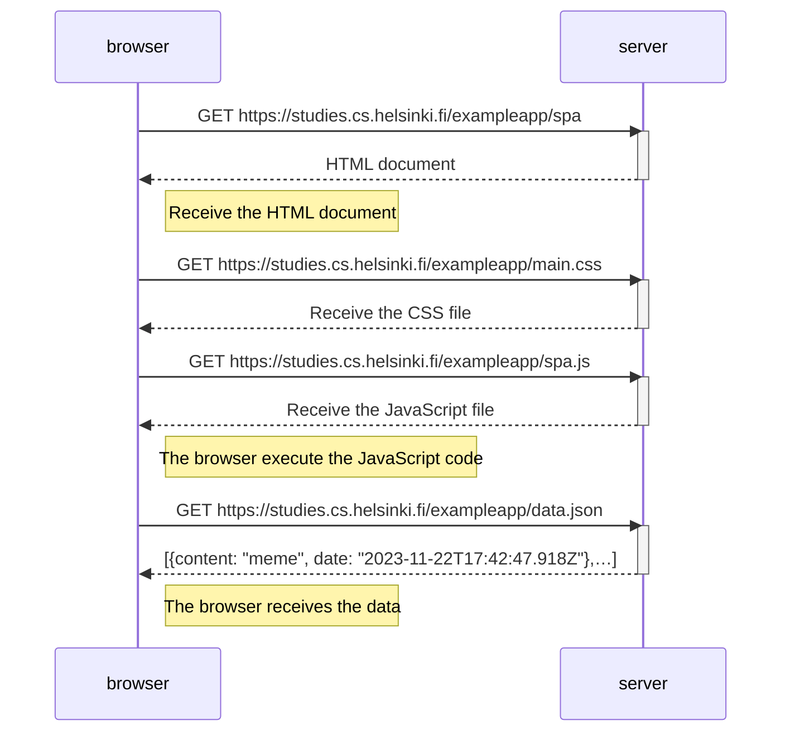

```mermaid
    sequenceDiagram
        participant browser
        participant server

        browser->>server: GET https://studies.cs.helsinki.fi/exampleapp/spa
        activate server
        server-->>browser: HTML document
        deactivate server

        Note right of browser: Receive the HTML document

        browser->>server: GET https://studies.cs.helsinki.fi/exampleapp/main.css
        activate server
        server-->>browser: Receive the CSS file
        deactivate server

        browser->>server: GET https://studies.cs.helsinki.fi/exampleapp/spa.js
        activate server
        server-->>browser: Receive the JavaScript file
        deactivate server

        Note right of browser: The browser execute the JavaScript code

        browser->>server: GET https://studies.cs.helsinki.fi/exampleapp/data.json
        activate server
        server-->>browser: [{content: "meme", date: "2023-11-22T17:42:47.918Z"},…]
        deactivate server

        Note right of browser: The browser receives the data
```