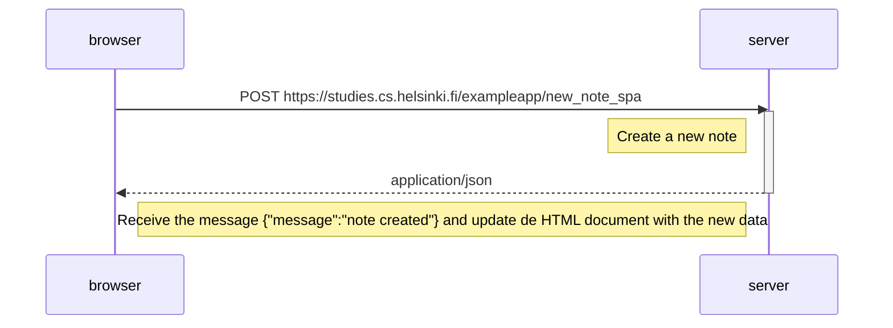

```mermaid
    sequenceDiagram
        participant browser
        participant server

        browser->>server: POST https://studies.cs.helsinki.fi/exampleapp/new_note_spa
        activate server

        Note left of server: Create a new note

        server-->>browser: application/json
        deactivate server

        Note right of browser: Receive the message {"message":"note created"} and update de HTML document with the new data
```